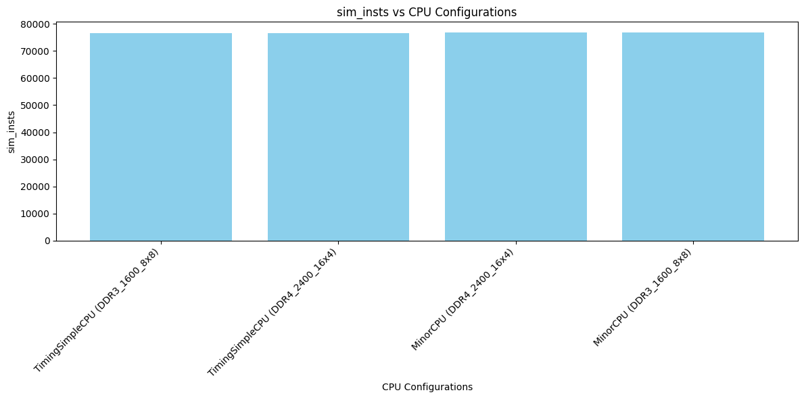
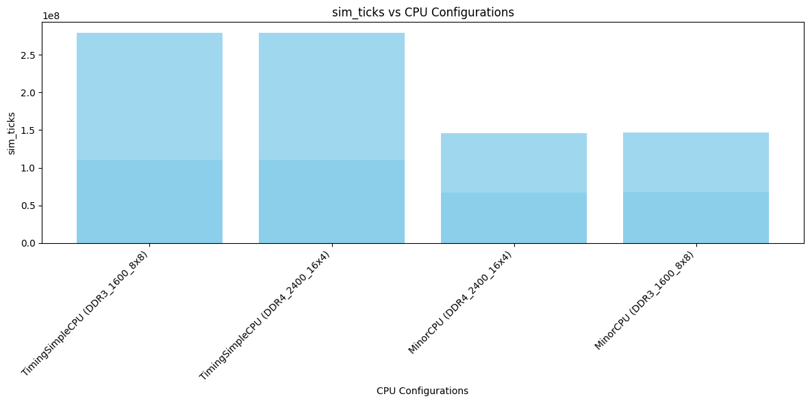
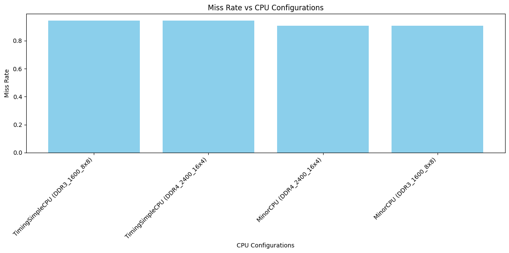
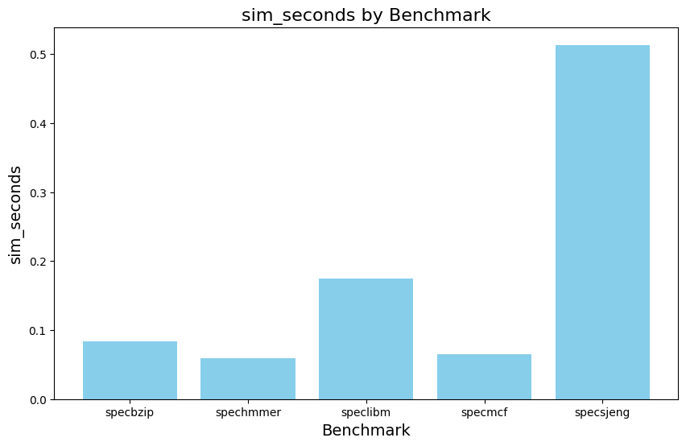
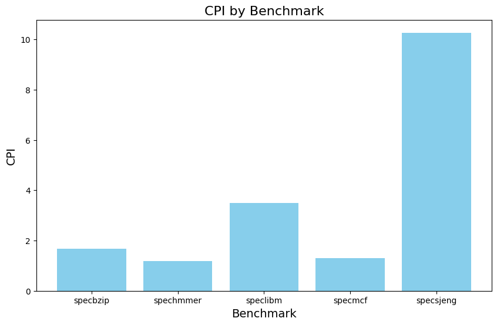
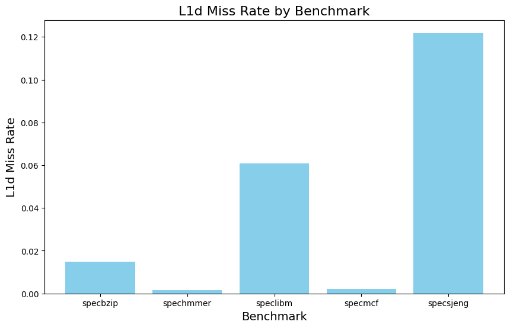
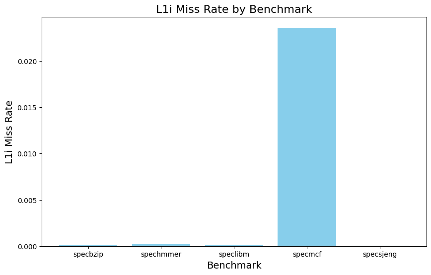
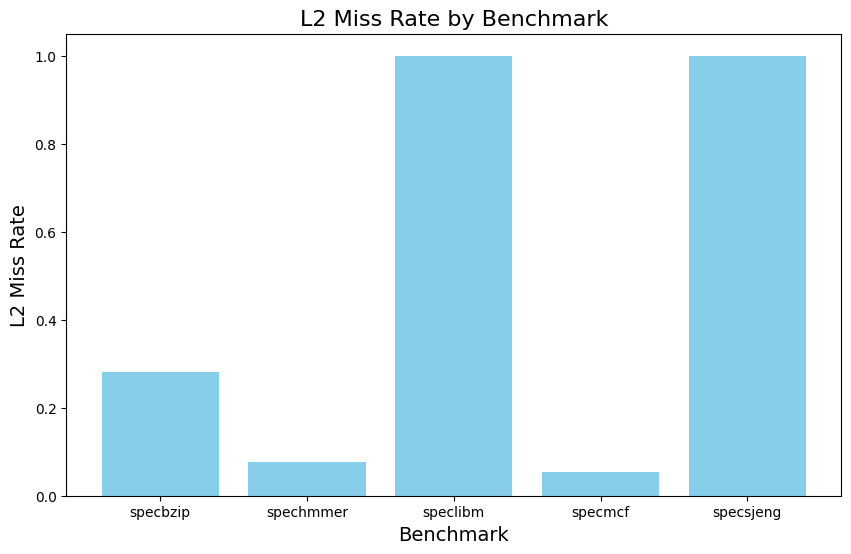

---
author:
- |
  Βογιατζής Χαρίσιος\
  ΑΕΜ:9192
title: Εργασία Αρχιτεκτονική Υπολογιστών
---

[Github Source Code](https://github.com/charisvt/arch_assignment)\

# Μέρος 1

## 

Το αρχείο starter_se.py αρχικοποιεί και περνάει pre-defined παραμέτρους
σχετικά με τη CPU και τις κρυφές μνήμες. Συγκεκριμένα περνάει τις
παραμέτρους για τον τύπο της CPU και για τις L1 instruction και data
caches, την L2 cache και την walk cache, που χρησιμοποιείται σε
περιπτώσεις TLB miss.\
Με την παράμετρο --cpu=\"minor\" επιλέξαμε να χρησιμοποιήσουμε τον
pre-defined τύπο CPU minor.\
Στη συνέχεια ορίζεται μία τάση 3.3V και ένα ρολόϊ 1GHz τα οποία θα
χρησιμοποιηθούν στο emulation του συστήματος.

## 

### a

Στο αρχείο config.ini και στο αντίστοιχο config.json μπορούμε να δούμε
επίσης το configuration που έχουμε ορίσει.\
Συγκεκριμένα για τη CPU βλέπουμε τον τύπο type=MinorCPU, άλλα και για
άλλα components όπως τις caches, τον branch predictor, το instruction
set κλπ.

    children=branchPred dcache dtb dtb_walker_cache executeFuncUnits icache interrupts isa itb itb_walker_cache tracer workload

Σχετικά με το ρολόι έχουμε sim_freq 1000000000000 (stats.txt) και
clock=1000 (config.ini).\

### b

sim_seconds είναι ο χρόνος που χρειάσθηκε για να τρέξει το πρόγραμμα
στην προσομοίωση και μετριέται σε CPU cycles που μετατρέπονται σε real
time δευτερόλεπτα.\
sim_insts είναι το πλήθος των συνολικών εντολών που εκτελέστηκαν στην
προσομοίωση.\
host_inst_rate είναι ο ρυθμός εκτέλεσης των εντολών της προσομοίωσης από
τον host.\

### c

Το συνολικό νούμερο των commited operations είναι 5831 σε αντίθεση με τα
commited instructions (simπαραπάνω) που είναι 5027.\
Ο λόγος γι'αυτή την διαφορά είναι ότι κάποιες σύνθετες εντολές
(assembly) μεταφράζονται σε περισσότερες micro operations (uOps).\
Επιπλέον μπορεί να υπάρχουν κάποιες εσωτερικές (internal ops) εντολές οι
οποίες συμπεριλαμβάνονται στα commited operations.\

### d

Από το stats.txt μπορούμε να εντοπίσουμε

        system.cpu_cluster.l2.demand_accesses::total          474

Σε περίπτωση που δεν υπήρχε το στατιστικό θα μπορούσαμε να υπολογίσουμε
τις προσβάσεις στις l2 από τα l1 misses, με την προϋπόθεση ότι δεν
γίνεται prefetching.

## 

Τα in-order μοντέλα CPU που έχει διαθέσιμα ο gem5 είναι το SimpleCPU το
οποίο εμπεριέχει τα BaseSimpleCPU, AtomicSimpleCPU και TimingSimpleCPU,
καθώς και το MinorCPU το οποίο χρησιμοποιήσαμε.\

### BasicSimpleCPU

Η BaseSimpleCPU εξυπηρετεί διάφορους σκοπούς:\
Διατηρεί την αρχιτεκτονική κατάσταση, τα στατιστικά κοινά στα μοντέλα
SimpleCPU.\
Καθορίζει λειτουργίες για τον έλεγχο για interrupts, τη ρύθμιση ενός
αιτήματος ανάκτησης, τον χειρισμό της ρύθμισης πριν από την εκτέλεση,
τον χειρισμό ενεργειών μετά την εκτέλεση και την προώθηση του υπολογιστή
στην επόμενη εντολή.\
Αυτές οι λειτουργίες είναι επίσης κοινές στα μοντέλα SimpleCPU.\
Υλοποιεί τη διεπαφή ExecContext.\
Η BaseSimpleCPU δεν μπορεί να εκτελεστεί από μόνη της. Πρέπει να
χρησιμοποιηθεί μία από τις κλάσεις που κληρονομούνται από το
BaseSimpleCPU, είτε AtomicSimpleCPU είτε TimingSimpleCPU.\
[Πηγή](https://www.gem5.org/documentation/general_docs/cpu_models/SimpleCPU#basesimplecpu)

### AtomicSimpleCPU

Το AtomicSimpleCPU είναι η έκδοση του SimpleCPU που χρησιμοποιεί
προσβάσεις ατομικής μνήμης.\
Χρησιμοποιεί τις εκτιμήσεις λανθάνοντος χρόνου από τις ατομικές
προσβάσεις για να εκτιμήσει τον συνολικό χρόνο πρόσβασης στην κρυφή
μνήμη.\
Η AtomicSimpleCPU προέρχεται από το BaseSimpleCPU και υλοποιεί
λειτουργίες ανάγνωσης και εγγραφής μνήμης, καθώς και για την επιλογή, η
οποία καθορίζει τι συμβαίνει σε κάθε κύκλο της CPU.\
Καθορίζει τη θύρα που χρησιμοποιείται για τη σύνδεση στη μνήμη και
συνδέει τη CPU με τη μνήμη cache.\
[Πηγή](https://www.gem5.org/documentation/general_docs/cpu_models/SimpleCPU#atomicsimplecpu)

### TimeSimpleCPU

Το TimingSimpleCPU είναι μια έκδοση του SimpleCPU που χρησιμοποιεί
προσβάσεις στη μνήμη χρονισμού. Σταματά στις προσβάσεις της κρυφής
μνήμης και περιμένει να ανταποκριθεί το σύστημα μνήμης πριν προχωρήσει.\
Όπως το AtomicSimpleCPU, το TimingSimpleCPU προέρχεται επίσης από το
BaseSimpleCPU και υλοποιεί το ίδιο σύνολο λειτουργιών.\
Καθορίζει τη θύρα που χρησιμοποιείται για τη σύνδεση στη μνήμη και
συνδέει τη CPU με τη μνήμη cache.\
Ορίζει επίσης τις απαραίτητες λειτουργίες για το χειρισμό της απόκρισης
από τη μνήμη στις προσβάσεις που αποστέλλονται.\
[Πηγή](https://www.gem5.org/documentation/general_docs/cpu_models/SimpleCPU#timingsimplecpu)

### MinorCPU

Το Minor είναι ένα μοντέλο επεξεργαστή κατά παραγγελία με fixed pipeline
αλλά διαμορφώσιμες δομές δεδομένων και συμπεριφορά εκτέλεσης.\
Προορίζεται να χρησιμοποιηθεί για τη μοντελοποίηση επεξεργαστών με
αυστηρή συμπεριφορά εκτέλεσης κατά σειρά και επιτρέπει την οπτικοποίηση
της θέσης μιας εντολής στη διοχέτευση μέσω της μορφής/εργαλείου
MinorTrace/minorview.py.\
Η πρόθεση είναι να παράσχει ένα πλαίσιο για μικροαρχιτεκτονικό
συσχετισμό του μοντέλου με έναν συγκεκριμένο, επιλεγμένο επεξεργαστή με
παρόμοιες δυνατότητες.\
[Πηγή](https://www.gem5.org/documentation/general_docs/cpu_models/minor_cpu)

### a

Για να τρέξουμε το πρόγραμμα fibonacci χρησιμοποιούμε

    ./build/ARM/gem5.opt -d fibonacci_minor_results configs/example/se.py --cpu-type=MinorCPU --caches --l2cache -c tests/test-progs/fibonacci/bin/fibonacci_arm -o "-n 100"

    ./build/ARM/gem5.opt -d fibonacci_timing_simple_results configs/example/se.py --cpu-type=TimingSimpleCPU --caches --l2cache -c tests/test-progs/fibonacci/bin/fibonacci_arm -o "-n 100"

για τα μοντέλα MinorCPU και TimingSimpleCPU αντίστοιχα.\
CPU and L2 metrics:\

::: center
  -------------------------- ---------- -----------------
                              MinorCPU   TimingSimpleCPU
          sim_ticks           87127500      152412500
          sim_insts            76896          76621
    l2.overall_hits::total       62            28
   l2.overall_misses::total     595            476
          Miss Rate            0.9056        0.9444
  -------------------------- ---------- -----------------
:::

### b

Αρχικά παρατηρούμε ότι το TimingSimpleCPU έκανε σχεδόν τον διπλάσιο
χρόνο να εκτελέσει το ίδιο πρόγραμμα, κάτι το οποίο περιμένουμε καθώς
είναι ένα απλούστερο μοντέλο σε σχέση με το MinorCPU.\
Συγκεκριμένα, χαρακτηριστικά όπως το pipelining και το speculative
execution τα οποία διαθέτει το MinorCPU και όχι το TimingSimpleCPU
επιτυγχάνουν αυτή τη διαφορά στους χρόνους εκτέλεσης.\
Αναφορικά με τις κρυφές μνήμες, βλέπουμε ότι και εδώ το MinorCPU
υπερτερεί με χαμηλότερο Miss Rate.\

### c

Για τις προσομοιώσεις επιλέχθηκαν τα 1GHz, 3GHz ως συχνότητες ρολογιού
και οι DDR3_1600_8x8 και DDR4_2400_16x4 για τις τεχνολογίες μνήμης.\
Επίσης δημιουργήθηκε το script
[fibonacci_sims.sh](https://github.com/charisvt/arch_assignment/blob/main/fibonacci_sims.sh)
για να τρέξουν οι προσομοιώσεις, καθώς και τα\
[process_results.py](https://github.com/charisvt/arch_assignment/blob/main/process_results.py),
[fibonacci_visualization.ipynb](https://github.com/charisvt/arch_assignment/blob/main/fibonacci_visualization.ipynb)
για την επεξεργασία και απεικόνιση των αποτελεσμάτων.

Αποτελέσματα:

::: center
  ----------------- ------- ---------------- ----------- ----------- -----------
         CPU         Clock   Memory Config    sim_ticks   sim_insts   Miss Rate
   TimingSimpleCPU   1GHz    DDR3_1600_8x8    279377000     76621      0.9444
   TimingSimpleCPU   3GHz    DDR4_2400_16x4   110104785     76621      0.9444
   TimingSimpleCPU   1GHz    DDR4_2400_16x4   278898000     76621      0.9444
      MinorCPU       3GHz    DDR4_2400_16x4   67276323      76896      0.9056
      MinorCPU       1GHz    DDR4_2400_16x4   146197000     76896      0.9056
      MinorCPU       3GHz    DDR3_1600_8x8    67417515      76896      0.9056
   TimingSimpleCPU   3GHz    DDR3_1600_8x8    110512710     76621      0.9444
      MinorCPU       1GHz    DDR3_1600_8x8    146688000     76896      0.9056
  ----------------- ------- ---------------- ----------- ----------- -----------
:::

{#fig:enter-label
width="16cm"}

{#fig:enter-label
width="16cm"}

{#fig:enter-label width="16cm"}

Παρατηρούμε ότι η αρχιτεκτονική του μοντέλου παίζει τον κυρίαρχο ρόλο
και η τεχνολογία των μνημών επηρρεάζει σε ελάχιστο βαθμό.\
Ο λόγος είναι ότι το (απλό) μοντέλο TimingSimpleCPU δεν χρησιμοποιεί
pipelining ούτε speculative execution και γι'αυτό υστερεί.\
Επίσης, παρατηρούμε ότι ότι τα sim_ticks μειώνονται με την αύξηση του
ρολογιού σε 3GHz αλλά δεν υποτριπλασιάζονται.\
Κάποια components, όπως οι μνήμες, έχουν fixed latencies στον
προσομοιωτή, συνεπώς δεν επηρεάζονται από την αύξηση του ρολογιού.\
Ένας ακόμη λόγος που μπορεί να βλέπουμε πλήρη μείωση στα sim_ticks είναι
ότι σε πολύ γρήγορα συστήματα είναι σύνηθες φαινόμενο οι μνήμες να
αποτελούν το bottleneck του συστήματος.\
Τέλος, υπάρχει η πιθανότητα να εμφανιστούν ατέλειες στο pipeline (branch
misspredictions, cache misses κλπ) όταν έχουμε ένα γρηγορότερο ρολόι
κάτι που όμως διαπιστώνουμε ότι δεν συμβαίνει εδώ.\

# Μέρος 2

## 

### 1

Στο αρχείο Options.py μπορούμε να βρούμε τις ακόλουθες πληροφορίες
σχετικά με τις (default) caches.

::: center
  --------------- ----- ------ ------
                   L2    L1i    L1d
       Size        2MB   32kB   64kB
   Associativity    8     2      2
  --------------- ----- ------ ------
:::

Η cache line έχει μέγεθος 64 bytes.\

### 2

::: center
  --------------- ---------- ----------- ---------- ---------- -----------
                   specbzip   spechmmer   speclibm   specmcf    specsjeng
    sim_seconds    0.083982   0.059396    0.174671   0.064955   0.513528
        CPI        1.679650   1.187917    3.493415   1.299095   10.270554
   L1d Miss Rate   0.014798   0.001637    0.060972   0.002108   0.121831
   L1i Miss Rate   0.000077   0.000221    0.000094   0.023612   0.000020
   L2 Miss Rate    0.282164   0.077760    0.999944   0.055046   0.999972
  --------------- ---------- ----------- ---------- ---------- -----------
:::

{#fig:enter-label
width="16cm"}

{#fig:enter-label width="16cm"}

{#fig:enter-label width="16cm"}

{#fig:enter-label width="16cm"}

{#fig:enter-label width="16cm"}

Παρατηρούμε ότι το specsjeng είναι πιο σύνθετο με αποτέλεσμα να έχει
πολύ μεγαλύτερο sim_seconds, καθώς και CPI και L1d και L2 Miss Rates.\
Το L1i Miss Rate του είναι χαμηλό, συνεπώς μπορούμε να καταλάβουμε ότι
δεν υπάρχει καλό locality των δεδομένων.\
Κάτι ακόμη που παρατηρούμε σχετικά με το specmcf είναι ότι έχει πολύ
υψηλότερο L1i Miss Rate σε σχέση με τα υπόλοιπα benchmark, τα οποία
είναι κοντά στο 0.\
Αυτό μπορεί να συμβαίνει λόγω μεγάλου αποτυπώματος μνήμης εντολών τα
οποία δεν χωράνε στην L1i, είτε λόγω κακού (spacial or temporal)
locality στις εντολές.\

### 3

::: center
  -------------------- ---------- ----------- ---------- ---------- -----------
                        specbzip   spechmmer   speclibm   specmcf    specsjeng
   (1GHz) sim_seconds   0.161025   0.262327    0.174671   0.127942   0.704056
   (3GHz) sim_seconds   0.039646   0.146433    0.146433   0.043867   0.449821
  -------------------- ---------- ----------- ---------- ---------- -----------
:::

Το σύστημα, ο CPU και οι μνήμες έχουν χρονιστεί στο 1GHz όπως
διαπιστώνουμε από το config.json.\
Χρονίζοντας το CPU στα 3GHz, τα υπόλοιπα παραμένουν στο 1GHz.\
Εαν προσθέσουμε ακόμη ένα CPU θα είναι και αυτός χρονισμένος στα 3GHz,
εκτός αν ορίσουμε εμείς κάποια άλλη επιθυμητή συχνότητα.\
Παρατηρώντας τα αποτελέσματα βλέπουμε ότι δεν υπάρχει το ίδιο scaling
για όλα τα benchmarks.\
To specbzip για παράδειγμα έχει speedup 4x ενώ το speclibm έχει μόλις
1.19x.\
Ο πιθανός λόγος είναι τα memory bottlenecks και πιθανώς ανεπάρκεια του
pipeline να αξιοποιήσει πλήρως τα 3GHz (πχ. λόγω dependancies).\

### 4

Επιλέγουμε το speclibm για να τρέξει με --mem-type=DDR3_2133_8x8.\
Παρατηρούμε ότι sim_seconds 0.171530 έναντι 0.174671, δηλαδή μία
επιτάχυνση μικρότερη του 2%.\
Η επιλογή του συγκεκριμένου benchmark έγινε λόγω του μεγάλου (σχετικά)
L2 Miss Rate με στόχο να αξιοποιηθεί η ταχύτητερα DDR3 ωστόσο η
επιτάχυνση που πετύχαμε δεν ήταν η αναμενώμενη.\
